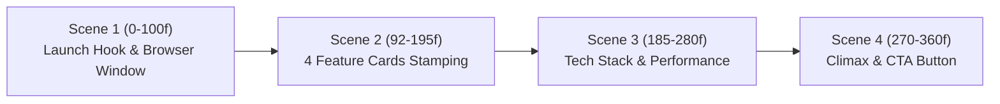

# 🎬 Dokumentasi Pembuatan Video Showcase KKN Vidya Vardhana Menggunakan Remotion

Dokumen ini memuat panduan teknis lengkap mengenai perancangan, instalasi, pengembangan animasi berbasis kode (*Programmatic Video*), penerapan tema **Neo-Brutalism Modern**, integrasi audio, proses rendering, hingga potensi pengembangan otomatisasi berbasis AI untuk proyek website **KKN Vidya Vardhana**.

---

## 📑 Daftar Isi
1. [Pengenalan & Konsep Remotion](#1-pengenalan--konsep-remotion)
2. [Tahap Instalasi & Inisialisasi Proyek](#2-tahap-instalasi--inisialisasi-proyek)
3. [Arsitektur & Konfigurasi Komposisi](#3-arsitektur--konfigurasi-komposisi)
4. [Penerapan Desain Neo-Brutalism Modern](#4-penerapan-desain-neo-brutalism-modern)
5. [Struktur Scene & Alur Animasi](#5-struktur-scene--alur-animasi)
6. [Integrasi Audio & Backsound](#6-integrasi-audio--backsound)
7. [Panduan Pengujian & Rendering Video](#7-panduan-pengujian--rendering-video)
8. [Peluang & Roadmap Pengembangan ke Depan](#8-peluang--roadmap-pengembangan-ke-depan)

---

## 1. Pengenalan & Konsep Remotion

**Remotion** ([remotion.dev](https://www.remotion.dev/)) adalah framework open-source berbasis **React, TypeScript, CSS (Tailwind), dan HTML Canvas/SVG** yang memungkinkan pembuatan video secara terprogram (*code-driven video*).

### Mengapa Menggunakan Remotion Dibanding Video Editor Biasa?
| Aspek | Video Editor Konvensional (Premiere / CapCut) | Programmatic Video (Remotion) |
| :--- | :--- | :--- |
| **Workflow** | Drag-and-drop manual di timeline grafis. | Ditulis murni dalam kode React (`tsx`). |
| **Konsistensi Desain** | Sulit menyamakan warna, padding, dan font web secara presisi. | 100% menggunakan token CSS/Tailwind dari website yang sama. |
| **Otomatisasi** | Harus diedit manual satu per satu jika ada konten baru. | Bisa otomatis merender ribuan video dari data database/API. |
| **Deterministic Rendering** | Rentan human error saat revisi elemen kecil. | Setiap frame dihitung secara matematis (`frame`, `fps`, `interpolate`). |

---

## 2. Tahap Instalasi & Inisialisasi Proyek

### 2.1 Menjalankan Inisialisasi Remotion CLI
Di terminal direktori proyek `d:\kknvidyavadhana-web\video`:
```bash
npx create-video@latest video
```

### 2.2 Konfigurasi Opsi yang Dipilih Saat Setup:
1. **Choose a template**: Memilih template TikTok / Blank.
2. **Git repository**: Mendeteksi repositori yang sudah ada (`D:\kknvidyavadhana-web`), memilih opsi `Yes` untuk melanjutkan tanpa membuat repo git baru.
3. **Add TailwindCSS?**: Memilih `Yes` (menggunakan `@remotion/tailwind-v4` dan TailwindCSS).
4. **Agent Skills**: Memilih `Select All (12 skills)` agar panduan teknis Remotion terbaca oleh AI agent.
5. **Agents target**: Memilih `Universal (.agents/skills)`.
6. **Installation scope**: Memilih `Project` (agar konfigurasi tersimpan lokal di dalam repo).
7. **Open in Notepad**: Memilih `No` (karena dibuka langsung di IDE).

### 2.3 Pemasangan Dependensi & Menjalankan Dev Server
```bash
cd video/video
npm install
npm run dev
```
Perintah `npm run dev` akan mengeksekusi `remotion studio` dan membuka UI interaktif di:
👉 **`http://localhost:3000`**

---

## 3. Arsitektur & Konfigurasi Komposisi

Pendaftaran komposisi video dilakukan pada file [video/video/src/Root.tsx](file:///d:/kknvidyavadhana-web/video/video/src/Root.tsx).

### Spesifikasi Video:
* **Komposisi Vertikal (TikTok / Reels / Shorts):** Resolusi **1080 x 1920 piksel** (Aspek Rasio 9:16).
* **Komposisi Horizontal (YouTube / Web):** Resolusi **1920 x 1080 piksel** (Aspek Rasio 16:9).
* **Frame Rate (FPS):** **30 fps**.
* **Durasi:** **360 frame** = **12 detik** (tempo cepat, dinamis, dan mempertahankan *retention rate* penonton).

Cuplikan kode pendaftaran di [Root.tsx](file:///d:/kknvidyavadhana-web/video/video/src/Root.tsx):
```tsx
import "./index.css";
import { Composition } from "remotion";
import { KKNShowcase } from "./KKNShowcase";

export const RemotionRoot: React.FC = () => {
  return (
    <>
      {/* Vertikal 9:16 untuk Medsos */}
      <Composition
        id="KKNShowcaseVertical"
        component={KKNShowcase}
        durationInFrames={360}
        fps={30}
        width={1080}
        height={1920}
      />

      {/* Horizontal 16:9 untuk Desktop / Presentasi */}
      <Composition
        id="KKNShowcaseLandscape"
        component={KKNShowcase}
        durationInFrames={360}
        fps={30}
        width={1920}
        height={1080}
      />
    </>
  );
};
```

---

## 4. Penerapan Desain Neo-Brutalism Modern

Untuk menghilangkan kesan visual yang kaku dan menyelaraskannya dengan desain asli web KKN di [frontend/src/index.css](file:///d:/kknvidyavadhana-web/frontend/src/index.css), diterapkan aturan visual **Neo-Brutalism Modern**:

### 4.1 Ciri Khas Visual Neo-Brutalist:
1. **Hard-Edge Drop Shadows:**
   Menghindari efek bayangan blur lembut (*diffused blur*). Menggunakan offset bayangan hitam solid:
   * `shadow-[6px_6px_0px_#000]`
   * `shadow-[8px_8px_0px_#172554]`
   * `shadow-[12px_12px_0px_#000]`
2. **Border Stroke Kontras Tinggi:**
   Semua kartu, tombol, badge, dan jendela browser menggunakan border tebal `border-4 border-black` atau `border-3 border-black`.
3. **Pola Latar Dot Matrix:**
   Menggunakan latar `#f4f4f0` dengan pola bintik radial retro dinamis:
   ```css
   backgroundImage: "radial-gradient(#172554 2.5px, transparent 2.5px)"
   ```
4. **Badge Miring Dinamis (*Tilted Stickers*):**
   Memberikan rotasi sudut kecil (-2° s/d +3°) dengan osilasi `Math.sin(frame / N)` agar elemen tampak seperti stiker tempel fisik.
5. **Running Marquee Ticker Tape:**
   Pita teks siaran berjalan terus menerus di bagian atas dan bawah layar:
   ```tsx
   const offset = (frame * speed) % 600;
   ```

### 4.2 Fisika Animasi Pegas (*Snappy Spring Physics*):
Agar animasi terasa bertenaga (*punchy slam*), tidak lambat, dan memiliki efek membal (*overshoot bounce*), digunakan konfigurasi pegas:
```tsx
const springAnim = spring({
  frame,
  fps,
  config: { damping: 9, mass: 0.6, stiffness: 220 },
});
```

---

## 5. Struktur Scene & Alur Animasi

Video berdurasi 12 detik (360 frame) dibagi ke dalam 4 scene yang bertransisi secara mulus menggunakan komponen `<Sequence />`:



### Scene 1: Launch Hook & Retro Browser Window (Frame 0 - 100 / ~3.3 Detik)
* **Elemen:**
  * Top Ticker: `"WEBSITE RESMI KKN VIDYA VARDHANA"`.
  * Badge Stiker: `🔥 OFFICIAL LAUNCH 2026 ✦` berputar miring.
  * Headline: `SELAMAT DATANG DI PORTAL KKN VIDYA VARDHANA`.
  * Mockup Browser Retro: Menampilkan address bar `kknvidyavardhana.id` dengan lampu status live hijau, tombol kontrol window bulat (merah, kuning, hijau), serta screenshot aset website (`public/1789229059685-689054940.png`).
  * Bottom Ticker: `"EXPLORE KEGIATAN DESA ✦ INOVASI MAHASISWA"`.

### Scene 2: Kartu Fitur Unggulan (Frame 92 - 195 / ~3.4 Detik)
* **Elemen:** 4 kartu fitur Neo-Brutalism dengan stagger pegas 8-frame:
  1. **Monografi Desa** (Latar Kuning `#ffd54f`, bayangan navy, ikon 🏛️).
  2. **Jurnal & Berita Kegiatan** (Latar Hijau `#b3f5d0`, bayangan hijau tua, ikon 📰).
  3. **Galeri Foto & Video** (Latar Biru `#bfdbfe`, bayangan navy, ikon 📸).
  4. **Dashboard CMS Instan** (Latar Peach `#fed7aa`, bayangan coklat tua, ikon ⚡).

### Scene 3: Teknologi & Performa (Frame 185 - 280 / ~3.1 Detik)
* **Elemen:** Grid teknologi website modern:
  * ⚛️ **React 19 & Vite** (Frontend cepat & interaktif).
  * 🎨 **TailwindCSS v4** (Desain Neo-Brutalism presisi).
  * 🟢 **Node.js & Express** (RESTful API terstruktur).
  * 🗄️ **MySQL Relational DB** (Penyimpanan data aman).
  * Pita penegas: `⚡ 100% Mobile Responsive` & `🔒 Secure JWT Auth`.

### Scene 4: Call to Action & Outro (Frame 270 - 360 / ~3.0 Detik)
* **Elemen:**
  * Badge: `✦ SAATNYA JELAJAHI ✦`.
  * Judul besar: `KKN VIDYA VARDHANA`.
  * Tombol CTA Bouncing: `🌐 kknvidyavardhana.id` berlatar gradasi kuning-emas dengan bayangan tebal `shadow-[12px_12px_0px_#000]`.
  * Stamp Penutup: `Dipersembahkan oleh Mahasiswa KKN Vidya Vardhana`.

---

## 6. Integrasi Audio & Backsound

File musik berirama ceria/upbeat disimpan pada:
📁 [video/video/public/backsound.mp3](file:///d:/kknvidyavadhana-web/video/video/public/backsound.mp3)

### Implementasi di Remotion:
Menggunakan komponen bawaan `<Audio />` dari `remotion` dengan interpolasi volume untuk menghasilkan efek **Fade-In** pada 20 frame pertama dan **Fade-Out** pada 25 frame terakhir:

```tsx
import { Audio, staticFile, interpolate } from "remotion";

<Audio
  src={staticFile("backsound.mp3")}
  volume={(frame) =>
    interpolate(frame, [0, 20, 335, 360], [0, 0.85, 0.85, 0], {
      extrapolateLeft: "clamp",
      extrapolateRight: "clamp",
    })
  }
/>
```

---

## 7. Panduan Pengujian & Rendering Video

### 7.1 Menjalankan Studio Interaktif (Real-Time Preview)
```bash
cd d:\kknvidyavadhana-web\video\video
npm run dev
```
Akses `http://localhost:3000` untuk memutar video, menggeser timeline scrubber per-frame, atau mengubah kode secara hot-reload.

### 7.2 Render Cuplikan Gambar Frame Tertentu (Still Render)
Untuk memverifikasi tata letak tanpa merender keseluruhan video:
```bash
npx remotion still KKNShowcaseVertical out/neo-frame45.png --frame=45 --overwrite
```

### 7.3 Render File Video Lengkap (.mp4)
Jalankan perintah render CLI:
```bash
npx remotion render KKNShowcaseVertical out/kkn-showcase-neobrutalism.mp4
```

Hasil render tersimpan di:
📁 **`D:\kknvidyavadhana-web\video\video\out\kkn-showcase-neobrutalism.mp4`**

> 💡 **Shortcut Windows**: Untuk membuka foldernya langsung di File Explorer:
> ```powershell
> explorer.exe /select,"D:\kknvidyavadhana-web\video\video\out\kkn-showcase-neobrutalism.mp4"
> ```

---

## 8. Peluang & Roadmap Pengembangan ke Depan

Implementasi Remotion pada repositori ini membuka potensi besar untuk otomatisasi konten media digital KKN:

### 1. Automated AI Video Generator untuk Berita KKN (Database-Driven)
* **Mekanisme:** Mengintegrasikan Remotion dengan backend Express & MySQL (`/api/articles`).
* **Hasil:** Setiap kali mahasiswa mengunggah artikel kegiatan baru melalui Dashboard Admin, sistem backend dapat memicu perintah `remotion render` secara otomatis untuk membuat video TikTok 15 detik berisi judul berita, foto kegiatan, dan kutipan isi berita tanpa perlu edit manual.

### 2. Integrasi Suara Narasi AI (Text-to-Speech) & Auto-Captions
* Memanfaatkan AI Voiceover (seperti ElevenLabs atau OpenAI TTS) untuk membacakan ringkasan kegiatan dalam Bahasa Indonesia.
* Memanfaatkan library `@remotion/captions` bawaan untuk menghasilkan subtitle animasi kata-per-kata (*word-by-word animated highlights*) yang sinkron dengan tempo suara narasi.

### 3. Video Laporan & Infografis Rekap Kegiatan Bulanan
* Mengambil statistik riil dari database (misal: "X Program Kerja Telah Terlaksana", "X Warga Terdampak", "X Dokumentasi Terkumpul").
* Menampilkan animasi angka berhitung (*counter animated numbers*) yang bergerak cepat dari 0 hingga angka aktual.

### 4. Otomatisasi Render via CI/CD (GitHub Actions)
* Menjadwalkan rendering video rekap mingguan setiap hari Minggu secara otomatis di cloud menggunakan GitHub Actions atau Remotion Lambda, lalu otomatis mengunggah video ke Google Drive / media sosial KKN.

---

*Dokumentasi ini dibuat untuk proyek KKN Vidya Vardhana — 2026.*
